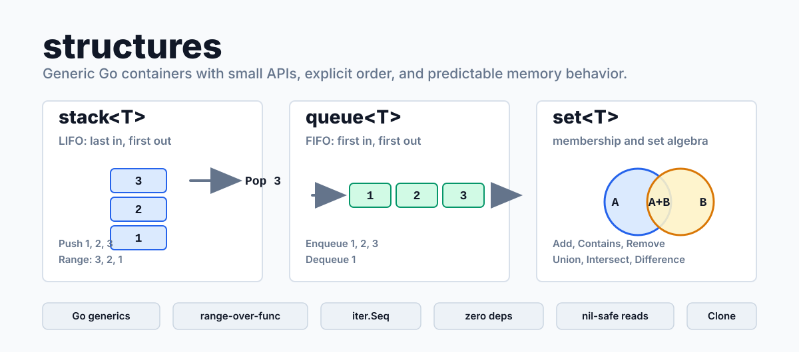
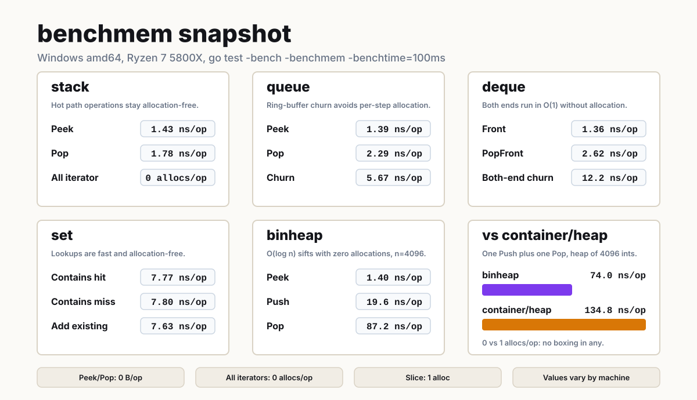

# structures

Generic, idiomatic data structures for Go — small, allocation-friendly, and
built on the Go 1.23+ standard library, including range-over-func iterators.





`structures` is a growing collection of generic container types. Each package is
self-contained, dependency-free, and documented with runnable examples.

## About Structures

Structures aims for containers with predictable behavior, small APIs, and
explicit trade-offs instead of hidden machinery.

The library is intentionally practical. It does not try to wrap every possible
data-structure pattern or replace Go slices and maps. Instead, it focuses on the
cases where a named container makes code easier to read: a LIFO stack, a FIFO
queue, and other compact structures where the order of operations matters.

The project values:

- **Order** — iteration and removal order are part of each package contract, not
  an implementation detail.
- **Balance** — APIs stay small enough to remember, but still expose the memory
  controls needed in long-running programs.
- **Clarity** — empty reads use the `(value, ok)` convention, examples are
  runnable, and package docs explain nil receivers and memory behavior.
- **Predictability** — containers are slice-backed, dependency-free, and
  explicit about when capacity is reused or released.

## Requirements

Go 1.23+ (for range-over-func iterators). The module targets Go 1.26.

## Install

```go
import "github.com/Nergous/structures/stack"
```

## Packages

| Package            | Description                                                   | Docs                          |
| ------------------ | ------------------------------------------------------------- | ----------------------------- |
| [`stack`](./stack) | Generic, slice-backed LIFO stack with non-consuming iteration. | [README](./stack/README.md) |
| [`queue`](./queue) | Generic, slice-backed FIFO queue with non-consuming iteration. | [README](./queue/README.md) |
| [`deque`](./deque) | Generic ring-buffer double-ended queue with O(1) push and pop at both ends. | [README](./deque/README.md) |
| [`set`](./set)     | Generic, map-backed set with unordered iteration and set algebra. | [README](./set/README.md) |
| [`binheap`](./binheap) | Generic binary heap: min, max, or custom order; type-safe `container/heap` replacement. | [README](./binheap/README.md) |
| [`pqueue`](./pqueue) | Generic keyed priority queue: change or remove any key's priority in O(log n); stable for equal priorities. | [README](./pqueue/README.md) |

More containers are on the way.

## When to use it

Use Structures when the container itself is part of the program's meaning:

- a stack for undo history, parser state, tree traversal, or backtracking;
- a queue for breadth-first traversal, work scheduling, buffering, or staged
  processing;
- a deque for sliding windows, work stealing, or histories that grow and trim
  from both ends;
- a heap for priority scheduling, top-k selection, shortest paths, or merging
  sorted streams;
- a priority queue when queued items must be re-prioritized or cancelled by
  identity, as in Dijkstra's algorithm, A*, or job schedulers;
- future containers where a compact, documented abstraction reads better than
  open-coded slice manipulation.

Plain slices and maps are still the right choice for many jobs. Structures is for the
spots where naming the behavior makes the code more obvious and where tested
edge cases — empty reads, nil receivers, cloning, slicing, capacity control —
are worth having in one place.

## Quick start

```go
package main

import (
	"fmt"

	"github.com/Nergous/structures/stack"
)

func main() {
	s := stack.New[int]()
	s.Push(1)
	s.Push(2)
	s.Push(3)

	for !s.IsEmpty() {
		v, _ := s.Pop()
		fmt.Println(v) // 3, 2, 1
	}
}
```

## Design goals

- **Generic** — type-safe containers via Go generics, no `interface{}` boxing.
- **Idiomatic** — small APIs that follow standard-library conventions, such as
  the `(value, ok)` contract and [`iter.Seq`](https://pkg.go.dev/iter#Seq)
  iterators.
- **Allocation-friendly** — capacity preallocation where it matters, with
  explicit control over when backing memory is released.
- **Dependency-free** — standard library only.
- **Documented by examples** — exported behavior is backed by runnable examples
  that double as package documentation.

## API promises

Structures packages are designed around a few consistent rules:

- Read-only methods on nil receivers behave like empty containers.
- Operations on empty containers are not errors. Methods such as `Peek`, `Pop`,
  `PopN`, `Remove`, and lookup-style predicates return the zero value,
  `false`, or `nil` according to Go's usual comma-ok conventions.
- Methods panic only when the call cannot be completed because the receiver is
  nil and the method needs to store, resize, or release state. Examples include
  `Push`, `Add`, `Grow`, `Clear`, `Reset`, `Shrink`, and `Clip`.
- Non-nil containers, including zero-value structs where a package documents
  them as usable, remain valid after empty reads, failed removals, `Clear`, or
  `Reset`.
- `Clone` returns an independent shallow copy.
- `Slice` returns a detached slice in the same order as iteration.
- `Reset` empties a container while keeping capacity for reuse.
- `Clear`, `Shrink`, and `Clip` are explicit tools for releasing or reducing
  backing memory.
- Containers are not internally synchronized; callers that share a value across
  goroutines must provide synchronization.

## Documentation

Each package ships a detailed README and verified `example_test.go` files that
render on godoc:

```sh
go doc github.com/Nergous/structures/stack          # package overview
go doc github.com/Nergous/structures/stack Stack    # a type and its methods
```

## License

[MIT](./LICENSE) © Nergous
